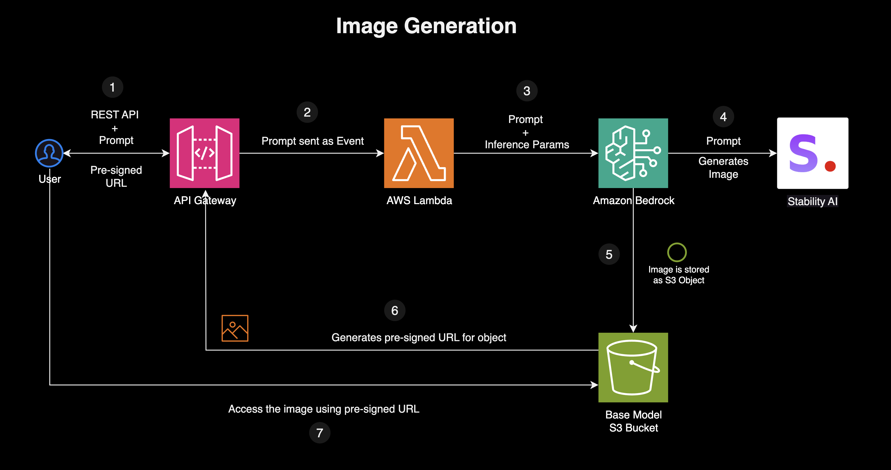

# Amazon Bedrock Image Generation Use Case 

## Overview

This AWS-based image generation pipeline enables users to generate AI-powered images using Amazon Bedrock and store them in Amazon S3. The system is triggered via an API Gateway, which invokes an AWS Lambda function. The Lambda function processes the user’s text prompt, calls Amazon Bedrock's Stability AI model to generate the image, and stores the result in an S3 bucket. A pre-signed URL is then generated and returned to the user, allowing them to securely access their image.



## How It Works (Step-by-Step)

### 1. User Submits a Request
- A user sends a **POST request** via an **API Gateway REST API**, including a **text prompt** for the image they want to generate.  
- Example request body:  
  ```json
  {
      "prompt": "A futuristic city skyline at sunset"
  }
  ```


### 2. API Gateway Forwards the Request to AWS Lambda
- API Gateway acts as an entry point and forwards the request to an **AWS Lambda function**.  
- The Lambda function is triggered with the event containing the **user prompt**.  


### 3. Lambda Calls Amazon Bedrock for Image Generation
- The Lambda function extracts the **text prompt** from the request:  
  ```python
  request_body = json.loads(event['body'])
  image_prompt = request_body['prompt']
  ```
- It then **invokes Amazon Bedrock** to generate an image using a **Stability AI model**:  
  ```python
  bedrock_response = client_bedrock.invoke_model(
      contentType='application/json', 
      accept='application/json',
      modelId=os.environ['BEDROCK_MODEL_ID'],
      body=json.dumps({
          "text_prompts": [{"text": image_prompt}],
          "cfg_scale": 10,
          "steps": 30,
          "seed": 0
      })
  )
  ```
- The **Bedrock model processes the request** and returns an image in **Base64-encoded format**.  


### 4. Lambda Decodes and Stores the Image in S3
- The Lambda function **extracts and decodes** the **Base64 image data**:  
  ```python
  image_response_data = json.loads(bedrock_response['body'].read())
  image_base64 = image_response_data['artifacts'][0]['base64']
  decoded_image = base64.b64decode(image_base64)
  ```
- It generates a **unique filename** using a timestamp:  
  ```python
  image_filename = 'generated-image-' + datetime.datetime.today().strftime('%Y-%m-%d-%H-%M-%S')
  ```
- The image is then **stored in an Amazon S3 bucket**:  
  ```python
  client_s3.put_object(
      Bucket=os.environ['BUCKET_NAME'],
      Body=decoded_image,
      Key=image_filename
  )
  ```

### 5. Lambda Generates a Pre-Signed URL
- To enable **secure access** to the stored image, Lambda generates a **pre-signed URL**:  
  ```python
  presigned_url = client_s3.generate_presigned_url(
      'get_object',
      Params={'Bucket': os.environ['BUCKET_NAME'], 'Key': image_filename},
      ExpiresIn=3600  # URL expires in 1 hour
  )
  ```
- The URL allows the user to **retrieve the image without exposing the S3 bucket publicly**.


### 6. Lambda Returns the URL to the User
- The **pre-signed URL** is sent back as an **API response**:  
  ```python
  return {
      'statusCode': 200,
      'body': json.dumps({'image_url': presigned_url}),
      'headers': {'Content-Type': 'application/json'}
  }
  ```
- The user can then **access the generated image** by clicking the returned **pre-signed URL**.


## **Key Benefits of This Architecture**  
- **Serverless & Scalable** – Uses **API Gateway, Lambda, and S3**, requiring no infrastructure management.  
- **Secure & Cost-Effective** – Images are stored privately in **S3**, accessible only via temporary **pre-signed URLs**.  
- **AI-Powered Generation** – Leverages **Amazon Bedrock’s Stability AI model** for high-quality images.  
- **Fast & Efficient** – Images are **generated, stored, and shared** in a single function execution.  


## Getting Started

Initialize Terraform
```sh
terraform init 
```

Plan the deployment
```sh
terraform plan -var-file=dev.tfvars
```

Apply the deployment
```sh
terraform apply -var-file=dev.tfvars -auto-approve
```

## Destroy  

```sh
terraform destroy -var-file=dev.tfvars
```
